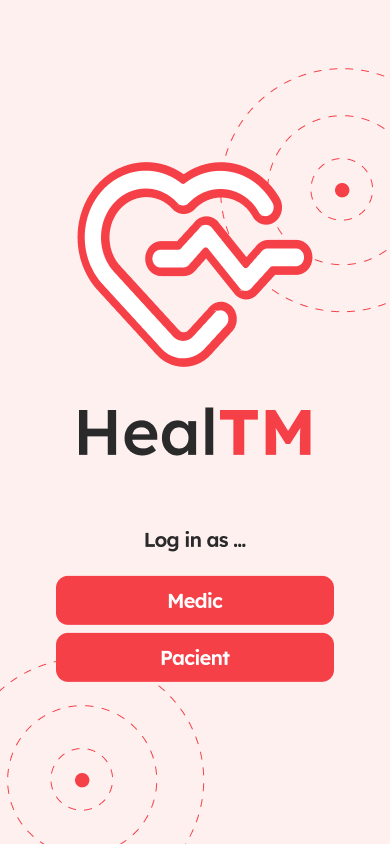
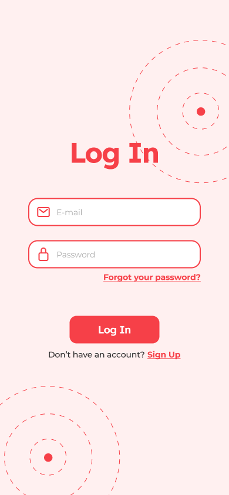
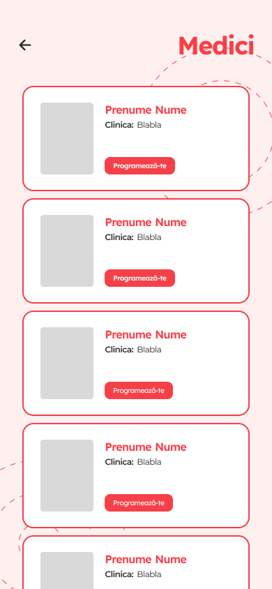
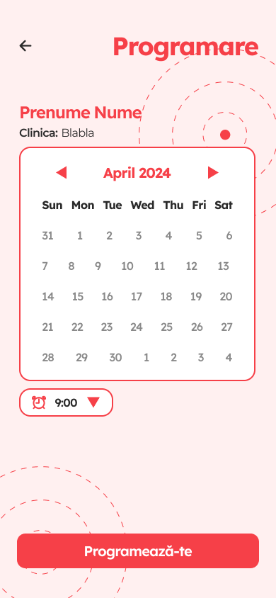
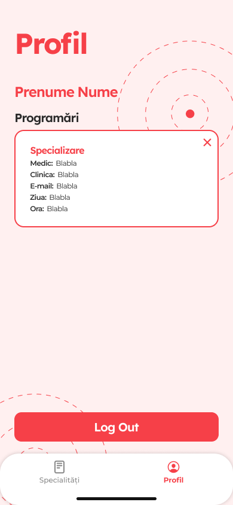

# HealTM

---

## Description
Introducing HealTM – Your Timisoara Health Navigator

Have you ever found yourself in need of a specific medical specialist but didn't know where to start looking?
HealTM is here to simplify your search and connect you with the right healthcare professional in just a few taps.
With this app, you gain instant access to all the doctors practicing in Timisoara, neatly sorted by their areas of expertise. Whether you're seeking a cardiologist, neurologist, or any other specialist, finding the right healthcare provider has never been easier.

#### HealTM Landing Screen

#### Log In Screen / Sign Up Screen

| Log In Screen                                   | Sign Up Screen                                    |
|-------------------------------------------------|---------------------------------------------------|
|  |  |

####  Categories Screen

####  Specialists Screen

#### Create appointment Screen

#### Profile Screen / Cancel appointment Overlay

| Profile Screen                                            | Cancel Appointment Overlay                                     |
|-----------------------------------------------------------|----------------------------------------------------------------|
|  |  |

## Figma
Here's the [Figma](https://www.figma.com/file/tUzkoUcURIbDgk1daoTlGa/ITEC-2024-HealTM?type=design&node-id=0%3A1&mode=design&t=oWNfI8rsmCFfafjP-1) mockup for the implemented app.

## Team members
+ [Gabriela Butnaru](https://github.com/gabrielabutnaru)
+ [Andreea Henteș](https://github.com/hentesandreea)
+ [Andra Mălăescu](https://github.com/04Andra)
